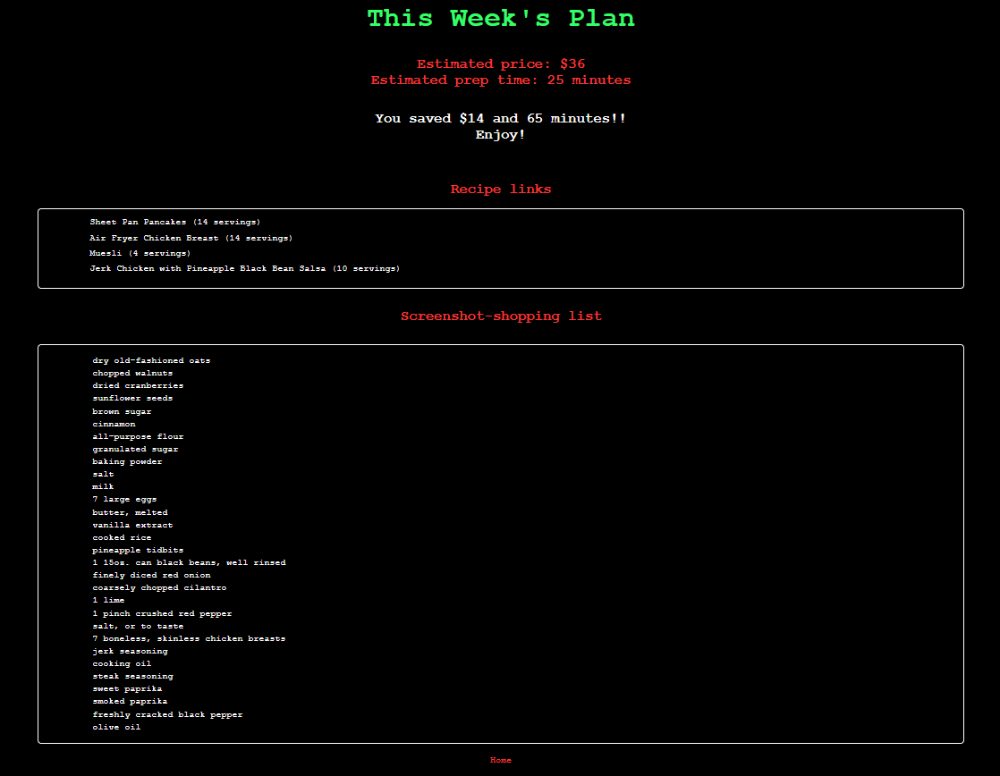

# Meal Maverick

Meal Maverick is a full-stack web application that simplifies weekly meal planning. In under 5 minutes, users can define their food goals, select budget-friendly recipes, and generate a complete shopping list with exact ingredient amounts, saving time, money, and food waste.

**Live App**: [https://meal-maverick.fly.dev](https://meal-maverick.fly.dev/)  
*(Deployed using Docker and Fly.io)*

## Demo

Here's a quick walkthrough of the Meal Maverick experience:


## Screenshots

### Home Page


### Goal Setup


### Menu


### Final Plan + Shopping List


## Tech Stack

- Backend: Python, Flask, Flask-SQLAlchemy
- Frontend: HTML, CSS, JavaScript
- Database: SQLite
- Web Scraping (optional): Selenium, BeautifulSoup
- Deployment: Docker and Fly.io

## Key Features

- Goal Setting – Define budget, prep time, people, and servings per day
- Dynamic Meal Selection – Browse meals sorted by cost; real-time budget and time progress bars
- Automated Shopping List – Ingredient quantities calculated and aggregated intelligently
- Recipe Links – Final meal plan includes direct links to cooking instructions

## Run Locally (No Docker)

1. Clone the repo and enter the app folder:
```bash
git clone https://github.com/gbeck139/meal-maverick.git
cd meal-maverick/web_app
```

2. Create and activate a virtual environment:
```bash
# Create virtual environment
python3 -m venv .venv

# Activate
# On macOS/Linux:
source .venv/bin/activate
# On Windows:
.venv\Scripts\activate
```

3. Install dependencies:
```bash
pip install -r requirements.txt
```

4. Add a `.env` file:
```bash
FLASK_SECRET_KEY=your-secret-key
```

5. Run the app:
```bash
flask run
```

Then go to http://127.0.0.1:5000

## Run with Docker (Recommended)

If you have Docker installed, you can run the app without setting up Python or pip.
1. Run the following to build the image:
```bash
git clone https://github.com/gbeck139/meal-maverick.git
cd meal-maverick/web_app
docker build -t meal-maverick .
```

2. Add a `.env` file:
```bash
FLASK_SECRET_KEY=your-secret-key
```

3. Launch the container
```bash
docker run --env-file .env -p 5000:5000 mealmaverick
```

Then visit http://localhost:5000

## Data Setup (Optional)

The `meals.db` file is already included in `web_app/`.

To regenerate it using the included scrapers:
```bash
cd meal_mav_scrapers
python budget_bytes_scraper.py
```

Note: You may need to adjust the output path to save the file to `../web_app/meals.db`.

## Technical Highlights

- Selenium Scraper – Navigates paginated recipe content and extracts structured data
- Smart Ingredient Aggregation – Combines, scales, and rounds ingredient quantities based on servings and people
- Real-Time Frontend Feedback – JavaScript-driven budget and time tracking on the meal selection page

## Future Enhancements

- Store API integration using ZIP code to personalize pricing
